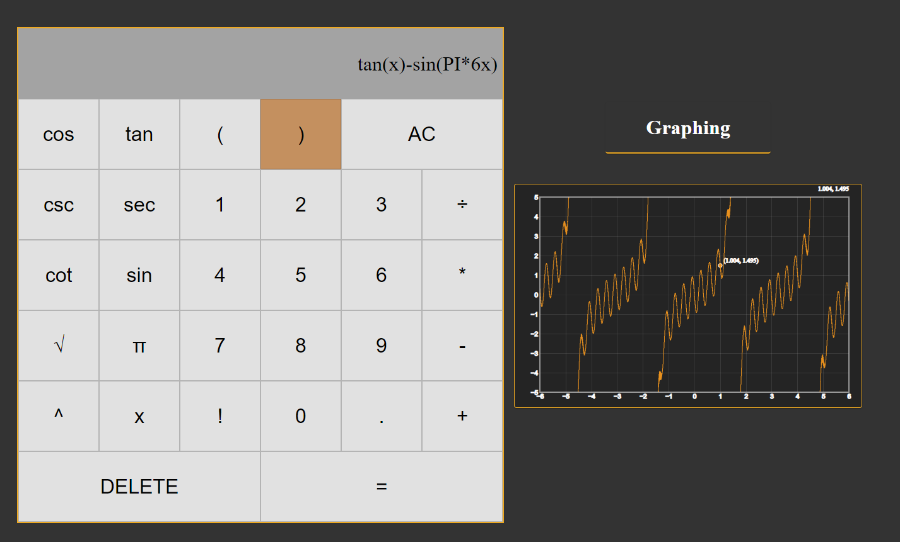

# calculator
 A graphing calculator leveraging React, Yarn, and Material UI. Enabled solving both basic and complex arithmetic functions and graphing capabilities using JavaScript, CSS, and external libraries for computing and graph visualization.

 To run the application you will need NodeJS(https://nodejs.org/en) and to have yarn(https://yarnpkg.com/getting-started/install) enabled. Then you run "yarn start" in  command prompt inside the calculator folder.
 
